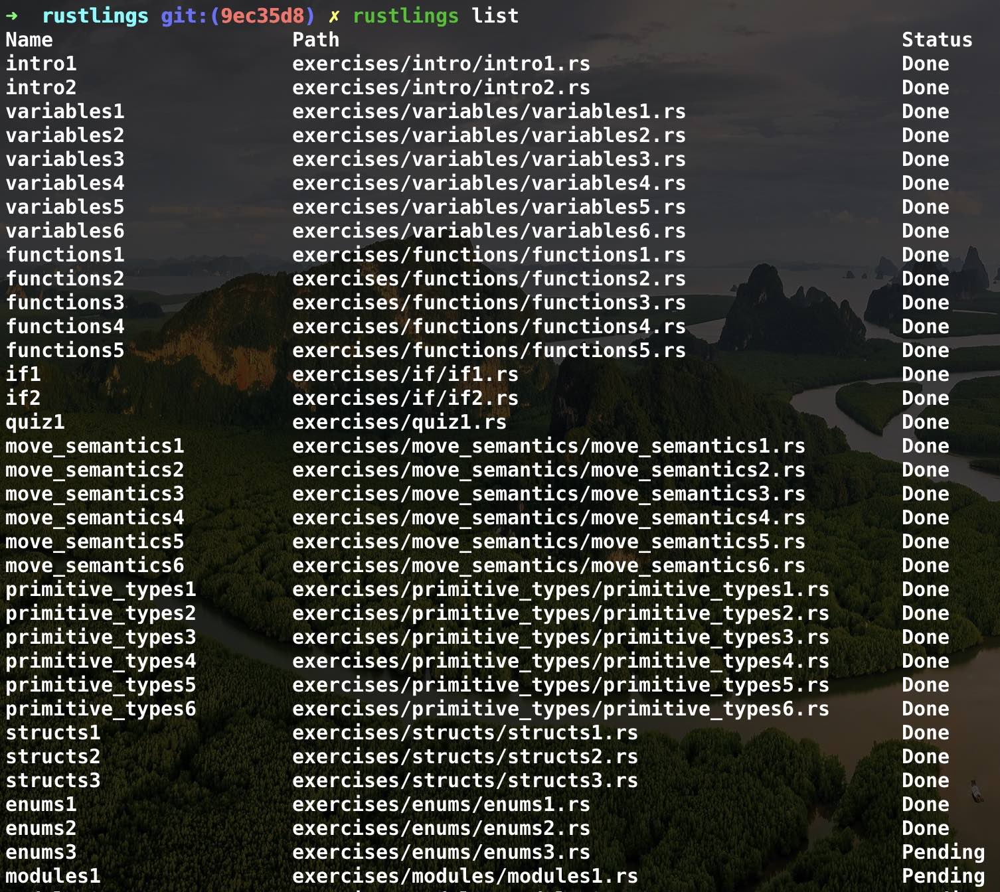
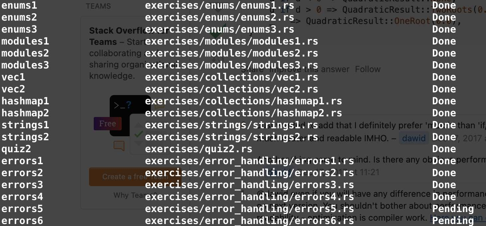

### Rust learning dashboard

- *7月1日*  使用rustlings进行练习
  - 进行到了结构体部分，涉及到结构体对str类型引用涉及到了生命周期的知识
  - 
- *7月2日* rustlings 进行到了错误处理部分，对?运算符印象深刻
  - 
- *7月3日* rustlings 错误处理的错误类型转换部分遇到了点问题，就是map_err函数，看着满屏的错误可太恶心了，所以刚进行到了generics部分。Happy Sunday。
  - 完成了rcore-os的lab1， 使用github的codespace，部分手册说的不太完整，但群友的反馈已经得到了修改。
